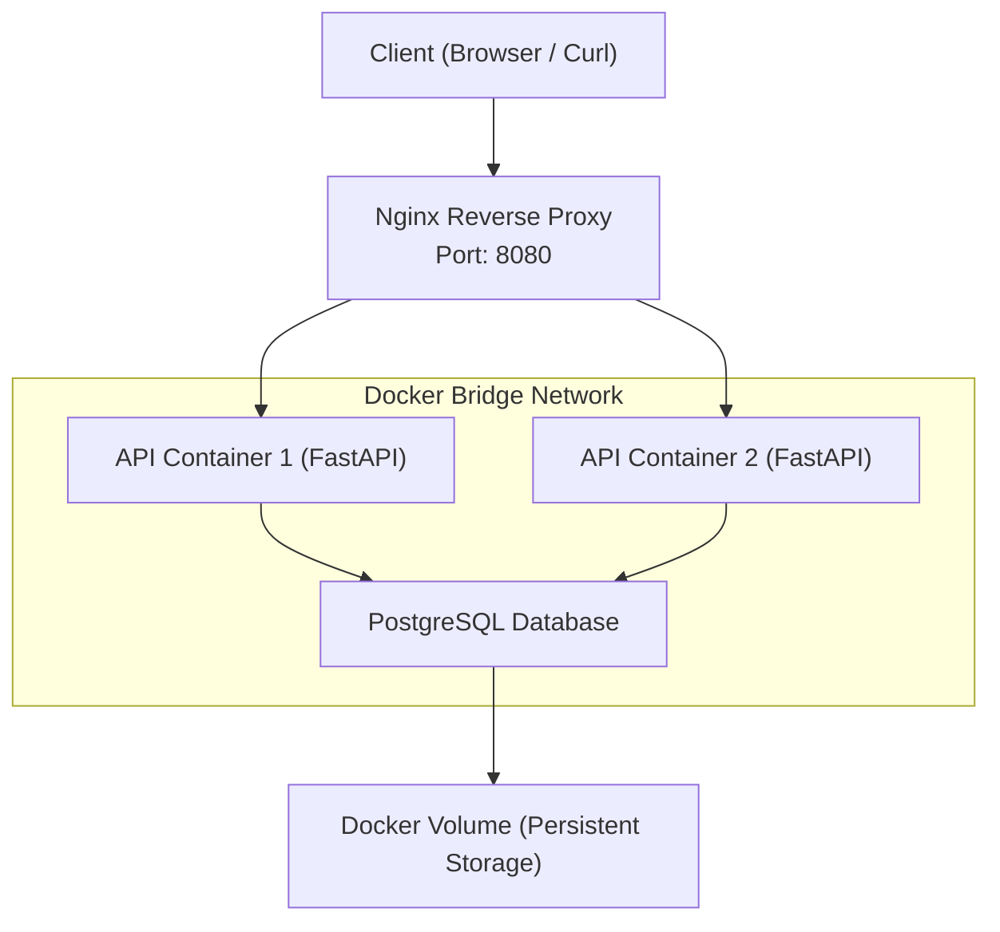

# Bug Tracker Containerized Stack


Production-style containerized system demonstrating service communication, scaling, and failure debugging using FastAPI, PostgreSQL, and Nginx.

## Overview

This project demonstrates how to design and operate a containerized multi-service architecture using FastAPI, PostgreSQL, and Nginx, focusing on real-world concerns like service communication, failure handling, and debugging.

## Demo

### 1. Health Check

```bash
curl http://localhost:8080/health
```

```json
{"status": "ok", "db_host": "db"}
```

### 2. Database Connectivity

```bash
curl http://localhost:8080/api/db-check
```

```json
{"db": "connected"}
```

### 3. Load Balancing Across API Containers

```bash
curl http://localhost:8080/api/whoami
```

```json
{"container": "api-1"}
{"container": "api-2"}
```

### 4. Failure Handling (Database Down)

```bash
docker compose stop db
curl http://localhost:8080/api/db-check
```

```json
{"db": "failed"}
```

### 5. Error Logs (Observed)

```bash
docker compose logs api
```

```
ERROR:app.db:DB connection failed: could not translate host name "db"
```

## [Architecture Diagram](/docs/architecture.md)


## Tech Stack

* **Backend**: FastAPI (Python)
* **Database**: PostgreSQL
* **Reverse Proxy**: Nginx
* **Containerization**: Docker
* **Orchestration**: Docker Compose
* **Networking**: Docker Bridge Network (DNS-based service discovery)

## Engineering Highlights

- **Multi-Stage Docker Build** — Reduced image size from ~1.1GB to ~95MB 
  by separating build dependencies from the final runtime image
- **Graceful Shutdown (SIGTERM)** — FastAPI handles shutdown lifecycle events 
  to close DB connections cleanly before container exits
- **Non-Root Container** — Runs as an unprivileged user; follows least-privilege principle
- **Health Checks** — All three services define healthcheck blocks; 
  Compose waits for dependency readiness before routing traffic
- **Resource Limits** — CPU and memory constraints defined per service in Compose
- **Horizontal Scaling** — Nginx upstream configured to load balance across 
  multiple API replicas (`--scale api=2`)
- **Persistent Storage** — Named volume ensures PostgreSQL data survives container restarts
- **Custom Bridge Network** — Services communicate via Docker DNS (service names), 
  not hardcoded IPs
- **Environment Isolation** — All secrets managed via `.env`; never committed to Git

## How to Run

### 1. Clone the repository

```bash
git clone <your-repo-url>
cd bug-tracker-containerized-stack
```

### 2. Create `.env`

```bash
cp .env.example .env
```

### 3. Start the system

```bash
docker compose up -d --build
```

### 4. Access services

* Health Check → http://localhost:8080/health
* DB Check → http://localhost:8080/api/db-check
* Load Balancing Test → http://localhost:8080/api/whoami

## Project Structure

```
bug-tracker-containerized-stack/
│
├── api/
│   ├── app/
│   │   ├── main.py
│   │   ├── config.py
│   │   ├── db.py
│   │   └── ...
│   ├── Dockerfile
│   └── requirements.txt
│
├── nginx/
│   └── nginx.conf
│
├── incident_reports/
│   ├── db_connection_failure.md
│   ├── invalid_env_config.md
│   ├── port_conflict.md
│   ├── nginx_load_balancing_issue.md
│   └── connection_refused_vs_timeout.md
│
├── docs/
│   └── architecture.md
│
├── docker-compose.yml
├── .env.example
├── .dockerignore
└── README.md
```

## Optimization Metrics

* Initial Image Size: ~225MB
* Optimized Image (Alpine + Multi-stage): ~120MB
* Reduction: ~46%

## Failure Scenarios & Debugging

This project simulates real-world failures:

* [Database container down](/incident_reports/db_connection_failure.md) (DNS failure)
* [Invalid DB credentials](/incident_reports/invalid_env_config.md) (authentication failure)
* [Port conflict on host](/incident_reports/port_conflict.md)
* [Nginx load balancing failure](/incident_reports/nginx_load_balancing_issue.md) (DNS caching issue)
* [Connection failure types](/incident_reports/connection_refused_vs_timeout.md) (DNS vs TCP vs timeout)

Each scenario includes:

* Symptoms
* Root cause
* Debugging steps
* Fix applied

## Limitations

* No authentication or authorization
* No HTTPS (HTTP only)
* No rate limiting
* No CI/CD pipeline
* No centralized logging
* No monitoring/metrics
* No database migration system
* Not deployed on Kubernetes

## Future Improvements

* Add authentication and role-based access control (RBAC)
* Integrate HTTPS using Nginx with TLS certificates
* Add centralized logging (ELK stack or Loki)
* Introduce monitoring and alerting (Prometheus + Grafana)
* Implement database migrations (Alembic)
* Add CI/CD pipeline for automated builds and deployments
* Deploy on Kubernetes for better scalability and orchestration
* Add rate limiting and API gateway features
* Improve resilience with retry mechanisms and circuit breakers

## What This Project Demonstrates

* Real-world container networking
* Service-to-service communication using DNS
* Debugging distributed systems
* Handling failure scenarios gracefully
* Production-style infrastructure design

## Summary

This project focuses on **understanding systems, not just building features**.

It demonstrates how services interact, fail, and recover — which is critical for Cloud, DevOps, and SRE roles.

**Version:** v1.0.0